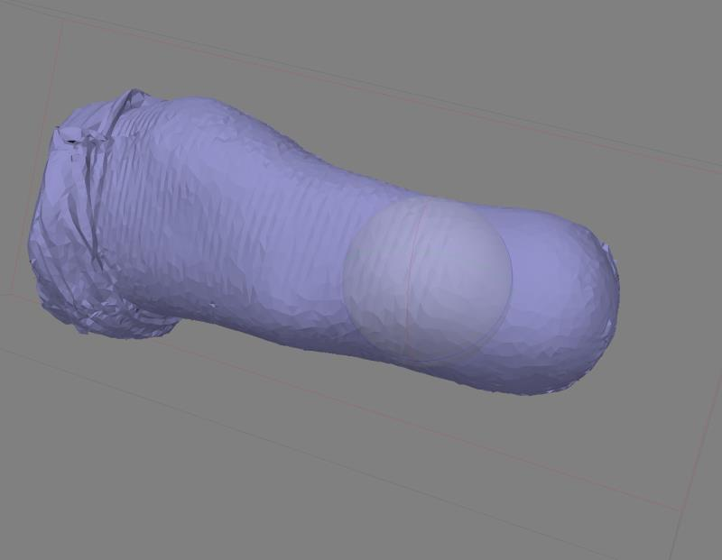

# Human-Frontier

### My responsibility in Photo-Scan Group:
•	Build 3D models for scanned pictures with Agisoft PhotoScan   
•	Prepared manual for end-users on using Agisoft PhotoScan to build 3D model for stumps  
•	Tested the influences of different imaging qualities on 3D modeling   
•	Inspired by GPS and found an innovative and effective theory to calculate the minimum scanned pictures required for 3D modeling  

### My Accomplishments:  
1. User Manual :  
https://github.com/zhz503/Human-Frontier/blob/master/Photogrammetry%20User%20Manual.pdf  
2. Theory part: (Calculating the minimum scanned pictures required for 3D modeling)  
https://github.com/zhz503/Human-Frontier/blob/master/theory%20part.pdf  
3. Photogeometry 3D model:
  
  

